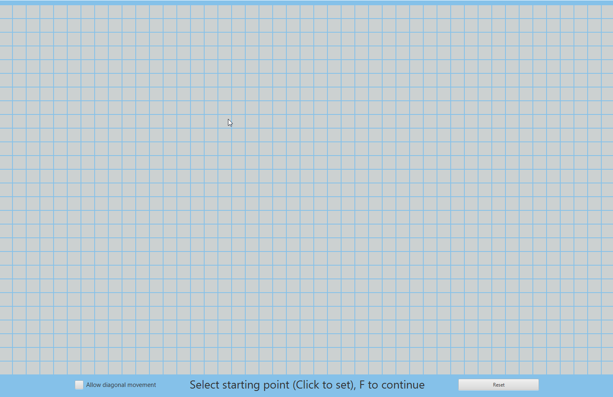
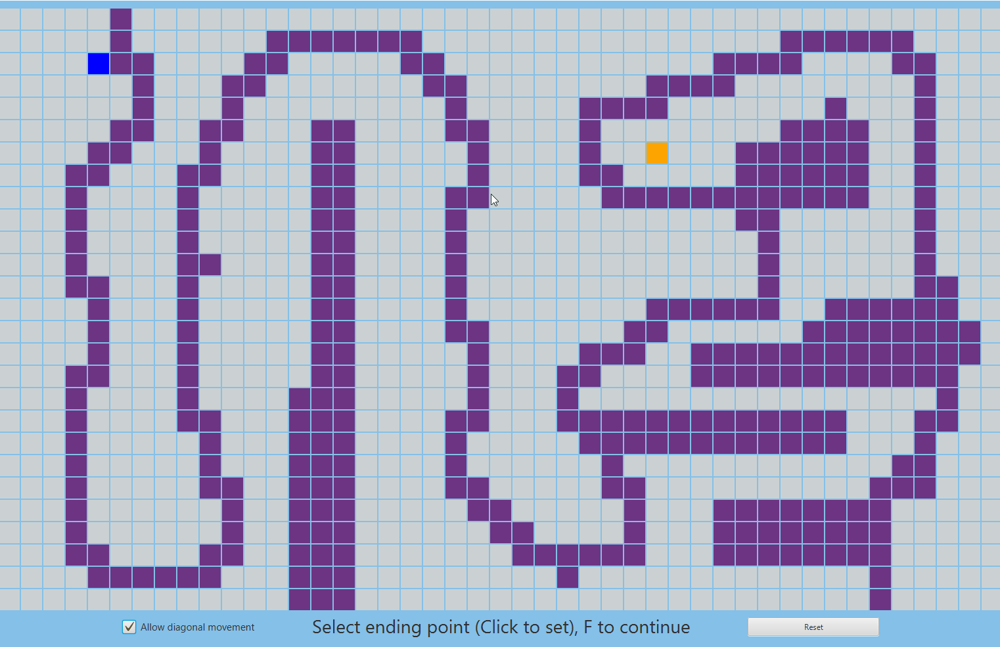

# Shortest-Path

Shortest Path Visualizer is a visualization of the shortest possible path between two specified points in a 2D grid

* Calculates shortest path using Dijkstra/A* algorithms

* Color-codes and displays all traversed squares

* Provides ability to place obstacles affecting algorithm's behavior

* Tools Used: Java, JavaFX
